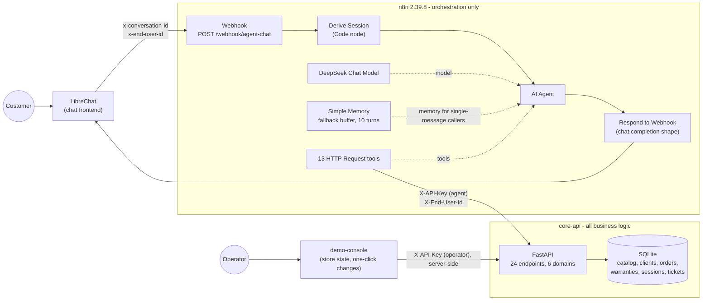

# AI Customer-Service Agent for Electronics Retail


A conversational customer-service agent for an electronics store. It sells consultatively from a
real catalog, tracks orders, checks warranty coverage, files claims, and hands the conversation
to a human when it should. It speaks Colombian Spanish to the customer and never states a fact
it did not get from a tool call.

The agent is an [n8n](https://n8n.io) workflow that orchestrates an LLM and thirteen tools. Every
one of those tools is an HTTP call into a [FastAPI](https://fastapi.tiangolo.com) microservice
that owns the catalog, the orders, the warranties and the memory. A chat frontend such as
[LibreChat](https://www.librechat.ai) talks to the workflow over a single OpenAI-compatible
webhook.

## Table of contents

- [Architecture](#architecture)
- [What is in this repository](#what-is-in-this-repository)
- [Quick start](#quick-start)
- [Talking to the agent](#talking-to-the-agent)
- [The three scenarios](#the-three-scenarios)
- [Who the customer is, and what they may see](#who-the-customer-is-and-what-they-may-see)
- [Tool catalog](#tool-catalog)
- [Sessions and memory](#sessions-and-memory)
- [How LibreChat is wired](#how-librechat-is-wired)
- [Editing the system prompt](#editing-the-system-prompt)
- [Configuration](#configuration)
- [Recording a demo](#recording-a-demo)
- [Further reading](#further-reading)

## Architecture



**The key design decision: n8n orchestrates, it does not decide.** Not a single business rule
lives in the workflow. Whether a warranty is still valid, whether an order's address may still
change, whether a phone number is well formed, whether a claim mentions a safety risk and must
be escalated automatically -- all of that is computed by the microservice and returned as data.
n8n contributes exactly three things: it turns an HTTP request into an agent invocation, it
resolves a session key, and it lets the LLM pick which tool to call.

That split is what makes the system testable. The microservice has 304 unit tests and an OpenAPI
spec; the rules are asserted there, in Python, not inferred from a screenshot of a node graph.
It also means the agent cannot quietly drift: if the LLM asks for something the store refuses,
it gets a `4xx` with an explicit reason and has to tell the customer, instead of a node
half-succeeding.

Two more decisions worth calling out:

- **A webhook, not n8n's built-in Chat Trigger.** The workflow speaks the OpenAI
  `chat/completions` request and response shape, so any OpenAI-compatible frontend can drive it
  with no adapter, and `curl` is a first-class client for testing.
- **Comparison happens server-side.** `compare_products` returns the fields where products
  actually differ, rather than handing the model two blobs of JSON and hoping it diffs them
  correctly.
- **Authorization is server-side too.** Who the customer is arrives as a header from the chat
  frontend, not as something they typed, and the microservice answers `403` when a tool call
  reaches for somebody else's data. See
  [Who the customer is, and what they may see](#who-the-customer-is-and-what-they-may-see).

## What is in this repository

```
.
├── README.md                     # this file
├── docker-compose.yml            # the whole stack: microservice, n8n, LibreChat, console
├── .env.example                  # every variable, one of which you fill in
├── CLAUDE.md                     # repository conventions
├── core-api/                     # FastAPI microservice (see core-api/README.md)
│   ├── app/                      # routers, repositories, schemas, SQLite access
│   ├── tests/                    # 304 pytest tests
│   └── Dockerfile
├── demo-console/                 # operations console for driving a demo
│   ├── app/                      # server-rendered HTML, no build step
│   └── Dockerfile
├── n8n-instance/
│   ├── workflows/
│   │   └── agente-retail-electronica.json   # the workflow, imported automatically
│   ├── prompts/
│   │   └── system_prompt.md      # source of truth for the agent's system message
│   ├── sync_prompt.py            # injects the prompt into the workflow JSON
│   └── README.md                 # prompt editing and re-import flow
├── provisioning/                 # what replaces the manual n8n setup
│   ├── n8n-entrypoint.sh         # provisions, then starts n8n
│   ├── provision-n8n.sh          # credentials and workflow, idempotent
│   └── setup-n8n-owner.js        # claims instance ownership over n8n's REST API
└── librechat/
    └── librechat.yaml            # registers the agent as a custom endpoint
```

## Quick start

You need Docker with the Compose plugin, and a DeepSeek API key.

### 1. Put your DeepSeek API key in `.env`

```bash
cp .env.example .env
```

Open `.env` and fill in the very first variable:

```
DEEPSEEK_API_KEY=sk-your-key-here
```

That is the only value you have to supply. Everything below it in the file already has a working
default, including every secret LibreChat needs. `.env` is gitignored, so your key stays local.

### 2. Bring up the stack

```bash
docker compose up -d --build
```

The first run takes a few minutes: it builds the microservice and the demo console, and pulls
six images. There is no second repository to clone and nothing to click through, because the
stack provisions itself while it starts:

- the microservice creates and seeds its SQLite database;
- n8n claims its own owner account, so the first-run wizard never appears;
- the `Tools API Key` and `DeepSeek account` credentials are imported with the ids the workflow
  references, so no node is left asking for a credential;
- the workflow is imported and published before n8n starts, so the production webhook is live
  the moment n8n accepts connections.

All of it is idempotent. `docker compose up -d` a second time changes nothing, and a credential
you edited by hand is left alone.

One consequence worth knowing before you edit a fixture: the microservice's state lives on the
`api-data` volume, and that volume is mounted over the directory the seed files ship in, so it
keeps the copy made the first time the stack came up. Changing `core-api/app/data/seed/*.json`
or `schema.sql` and rebuilding therefore changes nothing on a stack that has already run. Drop
that one volume to pick the new fixtures up -- `docker compose rm -sf api && docker volume rm
<project>_api-data && docker compose up -d --build api`, which leaves n8n and LibreChat
untouched and costs you only the orders a previous demo created.

### 3. Open LibreChat and talk to the agent

Go to `http://localhost:3080`, create an account with the sign-up link, and pick **Retail
Support Agent** in the model selector. That is the whole setup.

The account is local to this stack: the address is never contacted and nothing leaves the
machine. Sign-up answers with a "check your email to verify your address" notice, which you can
ignore; this instance sends no mail and unverified accounts are allowed to log in.

Try: *"Necesito un portatil para diseno grafico por menos de 5 millones."*

### What is running

| Service | Address | What it is |
|---|---|---|
| `librechat` | `http://localhost:3080` | the chat frontend you use |
| `api` | `http://localhost:8000` | the microservice; OpenAPI docs at `/docs` |
| `n8n` | `http://localhost:5678` | the workflow editor, if you want to look inside |
| `demo-console` | `http://localhost:8090` | the operations console: the store's support tickets, orders and warranties, and a click to change them |
| `n8n-init` | -- | runs once to create the n8n owner, then exits |
| `mongodb`, `meilisearch`, `vectordb`, `rag_api` | internal | what LibreChat needs to run |

Nothing but the first four publishes a port.

You never need n8n for the demo itself, but it is worth opening to watch the agent's tool calls
as they happen. Provisioning creates its owner account for you:

| | |
|---|---|
| Email | `owner@localhost.local` |
| Password | `Localdemo1` |

Those are the defaults in `.env.example`; change `N8N_OWNER_EMAIL` and `N8N_OWNER_PASSWORD`
before the first `docker compose up` if you want different ones. They are local-only, so they
are deliberately boring.

### If it does not come up

```bash
docker compose ps           # which service is not running
docker compose logs n8n     # the provisioning output lives here
```

- **`dependency failed to start: container ...-n8n-1 is unhealthy`.** Almost always the DeepSeek
  key. `docker compose logs n8n` prints a banner naming the variable and the file. Fill in
  `DEEPSEEK_API_KEY` in `.env` and run `docker compose up -d` again.
- **`Mismatching encryption keys`.** `N8N_ENCRYPTION_KEY` in `.env` no longer matches the key
  stored in the `n8n-data` volume from an earlier run. Either restore the old value, or throw
  the volume away with `docker compose down -v` and let the stack provision a fresh instance.
- **Ports 3080, 8000, 5678 or 8090 already in use.** Another stack is holding them; stop it
  first.

## Talking to the agent

The webhook accepts an OpenAI `chat/completions` request and answers with an OpenAI
`chat.completion` response, so the conversation is just the `messages` array you send back each
turn.

```bash
curl -s -X POST http://localhost:5678/webhook/agent-chat \
  -H 'Content-Type: application/json' \
  -H 'x-conversation-id: demo-001' \
  -H 'x-end-user-id: reviewer-1' \
  -d '{"messages":[{"role":"user","content":"Hola, necesito un portatil para diseno grafico por menos de 5 millones."}]}'
```

The response, with the assistant text abridged and its accents unescaped (the raw body escapes
them as `\u00e9` and friends):

```json
{
  "id": "chatcmpl-cid-d9a00888d1040888ec444c10",
  "object": "chat.completion",
  "created": 1789864843,
  "model": "deepseek-flash",
  "choices": [
    {
      "index": 0,
      "message": {
        "role": "assistant",
        "content": "Con gusto. Busqué en el catálogo portátiles hasta 5 millones y encontré dos opciones..."
      },
      "finish_reason": "stop"
    }
  ]
}
```

The `x-conversation-id` header is optional for a one-shot request but matters as soon as there
is more than one customer; see [Sessions and memory](#sessions-and-memory). A first reply takes
a few seconds, and longer when the agent chains several tool calls.

The `x-end-user-id` header is **not** optional if the conversation is going to touch customer
data. It is what LibreChat fills in with its authenticated user, and with the shipped settings
a tool call that arrives without it is refused by the microservice. Testing with `curl` means
picking a value and keeping it: it names the end user the same way a LibreChat login does, and
the store links it to the first identification number it verifies. Pick a different value and
you are a different person, with a clean slate. See
[Who the customer is, and what they may see](#who-the-customer-is-and-what-they-may-see).

## The three scenarios

The transcripts below are excerpts from real runs against the running stack, one conversation
each. Nothing is rewritten; the only edits are cuts, marked with `[...]` where a reply is shown
partially. The customer writes without accents, as people do in a chat box; the agent answers in
proper Spanish.

### 1. Consultative sale

The agent reads the budget and the intended use out of a single sentence, searches the real
catalog, compares the candidates server-side, recommends on the basis of the declared use, and
closes the sale -- reading the order back before it creates anything.

> **Customer:** Hola, necesito un portatil para diseno grafico por menos de 5 millones.
>
> **Agent:** Claro, con gusto. Para diseño gráfico lo que más pesa es la tarjeta gráfica y la
> memoria, y dentro de tu presupuesto de 5 millones esto es lo que tengo disponible:
> - CreatorBook Pro 15 de Zenda: 4.800.000, con Ryzen 7, 16 GB de RAM, 512 GB de almacenamiento,
>   gráfica RTX 3050 y pantalla de 15 pulgadas. Viene con 24 meses de garantía y hay 5 unidades
>   disponibles. Es la única del rango con gráfica dedicada, así que es la que mejor te sirve
>   para edición e ilustración.
> - WorkMate 15 de Northgate: 2.750.000, con Ryzen 5, 16 GB de RAM, 256 GB y pantalla de 15
>   pulgadas. También con 24 meses de garantía. Es más económica, pero su gráfica es integrada,
>   así que rinde menos en trabajo gráfico pesado.
>
> ¿Quieres que te ayude a pedir la CreatorBook Pro 15, o prefieres que te cuente algo más de
> alguna de las dos?
>
> **Customer:** Muestrame todos los portatiles por debajo de 5 millones, no solo dos.
>
> **Agent:** Claro, aquí está el catálogo completo de portátiles por debajo de 5 millones:
> - EveryDay 14 de Orbix: 1.650.000, Intel i3, 8 GB de RAM, 256 GB, pantalla de 14 pulgadas,
>   gráfica integrada. Garantía de 12 meses, 15 unidades.
> - WorkMate 15 de Northgate: 2.750.000, Ryzen 5, 16 GB de RAM, 256 GB, pantalla de 15 pulgadas,
>   gráfica integrada. Garantía de 24 meses, 9 unidades.
> - UltraBook Air 13 Lite de Zenda: 2.950.000, Intel i5, 8 GB de RAM, 512 GB, pantalla de 13
>   pulgadas, gráfica integrada. Garantía de 24 meses, 11 unidades.
> - UltraBook Air 14 de Zenda: 3.200.000, Intel i5, 8 GB de RAM, 256 GB, pantalla de 14
>   pulgadas, gráfica integrada. Garantía de 24 meses, 10 unidades.
> - CreatorBook Pro 15 de Zenda: 4.800.000, Ryzen 7, 16 GB de RAM, 512 GB, pantalla de 15
>   pulgadas, gráfica RTX 3050. Garantía de 24 meses, 5 unidades.
>
> [...] Para diseño gráfico, la CreatorBook Pro 15 sigue siendo la única con gráfica dedicada y
> la de mayor memoria y almacenamiento, así que es la que de verdad te aguanta ilustración y
> edición.
>
> **Customer:** Me quedo con la CreatorBook Pro 15. Mi cedula es 1010101010 y la envian a Calle
> 10 # 5-20, Bogota.
>
> **Agent:** Perfecto, Camila. Ya verifiqué tus datos y estás registrada con nosotros, así que
> no necesitas hacer ningún trámite adicional.
>
> Te confirmo lo que voy a dejar listo: un pedido de la CreatorBook Pro 15 de Zenda, a
> 4.800.000, con entrega en Calle 10 # 5-20, Bogotá. La compra queda con 24 meses de garantía.
>
> ¿Confirmas que lo pida así?
>
> **Customer:** Si, confirmo.
>
> **Agent:** Listo, Camila. Tu pedido quedó registrado: la CreatorBook Pro 15 de Zenda por
> 4.800.000, con entrega en Calle 10 # 5-20, Bogotá.
>
> El número de pedido es order-781942dd, y va con 24 meses de garantía. Queda en preparación y
> la entrega estimada es el 25 de septiembre de 2026.

Nobody told the agent the customer's name. It greeted her as Camila because `verify_client`
recognised the identification number and returned her record, and the prompt tells it to use a
returning customer's name rather than ask them to register again.

### 2. Order tracking

The customer does not know their order number. The agent asks for the identification instead,
lists what it finds, and translates the internal status code into plain language.

> **Customer:** Hola, quiero saber donde esta mi pedido.
>
> **Agent:** Hola, con gusto te ayudo con eso. Para consultar tu pedido necesito tu número de
> cédula. ¿Me lo compartes, por favor?
>
> **Customer:** Mi cedula es 1010101010
>
> **Agent:** Encontré varios pedidos registrados a tu nombre. ¿Cuál de estos quieres revisar?
> - order-001, un computador portátil, con entrega estimada para el 24 de septiembre
> - order-002, unos audífonos, entrega estimada el 21 de septiembre
> - order-003, una tablet, ya entregado
> - order-004, un celular, cancelado
>
> [...]
>
> Dime el número del pedido y te cuento en qué va.
>
> **Customer:** El order-002
>
> **Agent:** Tu pedido order-002, los audífonos, ya salió del centro de distribución. La entrega
> está estimada para el 21 de septiembre.

`DISPATCHED` never reaches the customer; the prompt maps all six status codes to sentences. The
two orders cut from the list above were left behind by earlier test runs, which is exactly why
the [demo checklist](#recording-a-demo) starts by resetting the database.

### 3. Warranty and escalation

Coverage is checked before anything is promised, the claim description is read back before it is
filed, and the customer's request for a human is honoured immediately -- without asking them to
confirm that, which would be absurd.

> **Customer:** Hola, mis audifonos dejaron de funcionar y creo que tienen garantia.
>
> **Agent:** Hola, gracias por escribirnos. Lamento lo de tus audífonos; con gusto te reviso la
> garantía. Para ayudarte necesito tu cédula, por favor.
>
> **Customer:** Mi cedula es 1010101010, el pedido es el order-002, y lo que pasa es que se
> apagaron de un momento a otro y ya no encienden.
>
> **Agent:** Camila, buenas noticias: revisé tu pedido order-002 y los audífonos sí tienen
> garantía vigente, con 33 meses todavía por cubrir. [...] Para dejarlo listo te confirmo los
> datos que enviaría: pedido order-002, cédula 1010101010 y la falla descrita como "los
> audífonos se apagaron de un momento a otro y ya no encienden". ¿Me confirmas que sí quieres
> radicarlo?
>
> **Customer:** Si, confirmo.
>
> **Agent:** Listo, Camila. Radiqué el reclamo de garantía y quedó registrado con el número de
> caso claim-509af0d6, con ticket ticket-6ac90d97.
>
> **Customer:** Gracias, pero prefiero que me atienda una persona.
>
> **Agent:** Claro que sí, Camila. Ya te pasé con una persona: tu ticket de atención es
> ticket-2aecbfc6 y un agente humano te atenderá en breve. El reclamo de garantía sigue
> registrado con el número claim-509af0d6, así que no se pierde nada.

There is a fourth path worth demonstrating that has no separate scenario: if the claim
description mentions a safety risk (smoke, fire, sparks, an explosion), the **microservice**
creates the human escalation by itself and returns the claim already flagged. That is a
deterministic rule in Python, not a judgement call left to the model, precisely because it is
the case with the least room for error.

## Who the customer is, and what they may see

Everything above assumes the agent is talking to the person whose data it reads. That is not
something the conversation can establish. An identification number a customer types into a chat
box is an assertion, not a credential: before this boundary existed, anyone could open a fresh
conversation, type a number that was not theirs and be handed that customer's orders, delivery
addresses and warranty history. The prompt could be told not to; a prompt is not an access
control, and it can be talked around.

So the identity travels on the transport instead.

```
LibreChat authenticates the user
        |  x-end-user-id: <LibreChat user id>            (librechat.yaml headers block)
        v
n8n reads it in Derive Session and puts it on every tool call
        |  X-End-User-Id: <same value>                   (from the flow, never via $fromAI)
        v
core-api treats it as the only trusted subject
```

The model never sees that header and cannot set it. The `Derive Session` node reads it from the
incoming request and every HTTP Request tool node sends it as a static header expression; no
tool takes it as a parameter, so there is nothing for the model to hallucinate or for a customer
to talk it into.

**Binding on first identification.** The first time an end user verifies an identification
number that exists, or registers a new one, the microservice records the link in
`identity_bindings`. From then on that end user is that customer:

| The end user asks for | Answer |
|---|---|
| their own customer's orders, warranty, history | served |
| a different identification number | `403 identity_mismatch` |
| an order number belonging to somebody else | `403 identity_mismatch` |
| anything customer-scoped before identifying | `403 identity_not_verified` |
| anything customer-scoped with no `X-End-User-Id` at all | `403 identity_required` |

The agent turns that into plain Spanish -- "no puedo consultar datos de otra persona desde esta
conversación" -- and the prompt tells it not to retry with another number. That wording is a
courtesy; the refusal itself is the `403`, and there are tests asserting each row of that table.

**Tools stopped taking an identification number where the store can derive one.** `create_order`
and `file_warranty_claim` no longer carry a `client_id` at all: the store already knows whose
they are. `list_orders_by_client` became `list_my_orders` and hits `GET /api/v1/orders/mine`,
which has no parameter to put somebody else's number into. `verify_client` and `register_client`
still take one, because stating an identification number is exactly what they are for -- but
they are the binding gate, and an end user already linked to somebody else is refused there
too. Looking up a number that is not registered does not bind anything, so probing cannot burn
your binding on a stranger.

**Two cases decided on purpose.**

*No identity header at all.* Refused, not waved through. With `IDENTITY_ISOLATION=enforced`,
which is what ships, a request with no `X-End-User-Id` has no subject, and every customer-scoped
endpoint answers `403 identity_required`. It is not pooled into a shared anonymous account,
because a shared account is a shared inbox: the first person to identify would lock everyone
else out, and everyone would read the first person's data until they did. The catalog, which is
not customer data, still answers without it. Testing with `curl` therefore means naming
yourself, which is one extra header. The escape hatch is `IDENTITY_ISOLATION=disabled`: no
binding, no refusals, the behaviour this system had before the header existed. It is off in the
shipped configuration, the service logs a warning at every boot while it is on, and
`GET /health` reports which mode is active. Be clear about what it costs: with isolation off,
every caller that sends no header shares one `anonymous` subject, so `GET /api/v1/orders/mine`
answers with whoever identified last, whoever is asking.

```bash
curl -s http://localhost:8000/health
# {"status":"ok","identity_isolation":"enforced","identity_rebinding":"denied"}
```

*An already-bound end user presenting a different number.* Refused, because that is the attack
the boundary exists for -- it is indistinguishable from the exploit above. The legitimate cases
have a better answer than weakening it: a reviewer who wants to see a second customer sends a
different `x-end-user-id`, and a second person on a shared machine logs into their own LibreChat
account. Both are new subjects with clean slates, and neither needs a setting. For the one case
that has no other answer -- several people taking turns under a single login, mid-recording --
`IDENTITY_REBINDING=allowed` moves the link to the new number. It gives away most of the
protection, so it is a deliberate switch, not an accident of the flow, and it is `denied` by
default.

**The operator is a different principal.** The endpoints that list every order, every warranty
and every support ticket, and the ones that change state for a demo, answer only to
`OPERATOR_API_KEY` -- a second key, distinct from the agent's `TOOLS_API_KEY`. That is what
makes the console's access distinguishable from a customer's: the agent has no tool for those
endpoints, and its key would not open them if it did. A caller holding the operator key is
outside the binding rule, which is why the console can read every customer and never gets bound
to one. There is no agent tool that reads tickets at all, so no customer can reach another
customer's tickets through the chat.

**What else is load-bearing, and is not this.** Two things hold the boundary up from outside
the microservice, and both should be read as part of it:

- **The n8n webhook has no authentication of its own, and port 5678 is published.** Anything
  that can reach `POST /webhook/agent-chat` can send whatever `x-end-user-id` it likes and be
  that user. On a laptop running this demo that is the operator's own machine; anywhere else it
  is the first thing to close, by putting the webhook behind the same authentication the chat
  frontend uses, or by not publishing the port.
- **The operations console holds `OPERATOR_API_KEY` and has no login of its own**, and port
  8090 is published too. It is an operator tool built for a recording session, not a hardened
  admin panel: it has no password and no CSRF token, so anyone who can reach that port reads
  every customer's orders and tickets. Bind it to `127.0.0.1:8090:8090` if the machine is not
  yours alone.

**What this does not do.** The link is trust on first use. A brand-new end user who has never
identified can still claim any number the first time, because nothing in this system proves an
identification number belongs to the person typing it -- there is no password, no one-time code,
no document check, and inventing one would be inventing a feature the assessment does not ask
for. What the boundary removes is enumeration: one authenticated user can no longer walk the
customer base, and a conversation can no longer switch customers halfway through. A real
deployment would put a verified identity in front of it and keep exactly this backend check.

The link is also one-way: one end user may only ever be one customer, but nothing stops two
LibreChat accounts from both identifying as the same customer, because each of them is unbound
the first time. Stopping that needs proof of identity, not a binding table. Session rows
(`/api/v1/sessions/{session_id}`) are anonymous scratch state until a customer is identified in
them, and fall under the same rule from that moment on.

## Tool catalog

Thirteen tools, each one node in the workflow and one endpoint in the microservice. All of them
authenticate with the agent's `X-API-Key` and carry the `X-End-User-Id` header the workflow
propagates; the ones marked *derived* get the customer from that header instead of from the
model. See [Who the customer is, and what they may see](#who-the-customer-is-and-what-they-may-see).

| Tool | Endpoint | What it does |
|---|---|---|
| `verify_client` | `GET /api/v1/clients/{client_id}` | Look up a client by identification number. Returns their contact details and, for a returning customer, what they mentioned in past conversations. |
| `register_client` | `POST /api/v1/clients` | Register a new client. The store validates identification, name, phone and email and rejects each one with a specific reason. |
| `save_session_context` | `PUT /api/v1/sessions/{session_id}` | Store what the customer said about themselves this session: name, budget, stated preference. |
| `get_catalog` | `GET /api/v1/catalog/products` | Search the catalog, optionally by category and maximum budget. Returns real prices, specs, stock and the months of warranty the product is sold with. |
| `compare_products` | `POST /api/v1/catalog/compare` | Compare products by id and return the fields where they actually differ. |
| `create_order` | `POST /api/v1/orders` | *derived.* Create an order for one product, and issue its warranty. Fails if the client is not registered or the product is out of stock. |
| `get_order_status` | `GET /api/v1/orders/{order_id}/status` | Current status of an order. |
| `get_order_eta` | `GET /api/v1/orders/{order_id}/eta` | Estimated delivery date of an order. |
| `update_delivery_address` | `PATCH /api/v1/orders/{order_id}/address` | Change a delivery address. Refused once the order is delivered or cancelled. |
| `list_my_orders` | `GET /api/v1/orders/mine` | *derived.* Every order of this customer, for the one who does not remember the order number. Takes no parameters. |
| `get_warranty_status` | `GET /api/v1/warranty/status` | Whether a product in an order has coverage and whether it is still valid. Distinguishes "never registered" from "expired". |
| `file_warranty_claim` | `POST /api/v1/warranty/claims` | *derived.* File a claim and return a ticket number. Escalates safety cases automatically. |
| `escalate_to_human` | `POST /api/v1/escalations` | Hand the conversation to a human agent and return a ticket number. |

The microservice exposes a few more endpoints the agent deliberately cannot reach: the ones that
write state so you can put the seed data into any shape you want for a demo, the three that list
the whole order book, every warranty and every support ticket at once, and the one that moves a
ticket through its lifecycle. Keeping them out of the tool catalog is the point -- the agent can
report that an order was dispatched, but it can never be the one that dispatched it -- and they
are held shut by more than that: they require `OPERATOR_API_KEY`, so the agent's key would be
refused even if somebody added the tool by mistake.

The comfortable way to use them is the demo console at `http://localhost:8090`, which is built
on exactly these endpoints. By hand they are (note the operator key):

```bash
# Advance an order. Valid: PENDING, PROCESSING, DISPATCHED, IN_TRANSIT, DELIVERED, CANCELLED.
curl -s -X PATCH http://localhost:8000/api/v1/orders/order-001/status \
  -H "Content-Type: application/json" \
  -H "X-API-Key: local-demo-operator-key" \
  -d '{"status":"IN_TRANSIT"}'

# Expire a warranty, to show the difference between expired and never registered.
curl -s -X PATCH http://localhost:8000/api/v1/warranty/warranty-001/terminate \
  -H "X-API-Key: local-demo-operator-key"

# Put it back under coverage, so the same demo can be run again.
curl -s -X PATCH http://localhost:8000/api/v1/warranty/warranty-001/reinstate \
  -H "X-API-Key: local-demo-operator-key"

# Or set the two fields validity is computed from, for any case in between.
curl -s -X PATCH http://localhost:8000/api/v1/warranty/warranty-001 \
  -H "Content-Type: application/json" \
  -H "X-API-Key: local-demo-operator-key" \
  -d '{"coverage_months":6,"purchase_date":"2024-03-15"}'

# Read the whole order book, every registered warranty with its validity computed, or the
# support-ticket queue.
curl -s http://localhost:8000/api/v1/orders      -H "X-API-Key: local-demo-operator-key"
curl -s http://localhost:8000/api/v1/warranty    -H "X-API-Key: local-demo-operator-key"
curl -s http://localhost:8000/api/v1/escalations -H "X-API-Key: local-demo-operator-key"

# Move a ticket: pending_agent -> in_progress needs an assignee, -> resolved needs a note, and
# a ticket the store raised for a safety risk refuses to close before somebody has taken it.
curl -s -X PATCH http://localhost:8000/api/v1/escalations/ticket-xxxxxxxx \
  -H "Content-Type: application/json" \
  -H "X-API-Key: local-demo-operator-key" \
  -d '{"status":"in_progress","assignee":"Laura Munoz"}'
```

Two demo setups worth knowing: putting an order into `DELIVERED` and then asking the agent to
change its delivery address makes it explain the restriction instead of retrying, and expiring a
warranty makes it distinguish "vencida" from "no registrada", which are different answers. Both
are reversible, so a run can be repeated without throwing the database away.

Every order response also carries `product_details`, the name, brand and price behind each
product id, which is what lets the agent say "los audifonos SoundWave ANC" instead of reading
`headphones-001` out loud. A product that has left the catalog still gets an entry, with those
three fields null, so an order never loses a line.

### Warranties, and the three answers the agent must be able to give

Every product in the catalog carries a `warranty_months` term, and `create_order` issues the
matching warranty as part of the sale: purchase date today, coverage taken from the product. An
order the agent takes is therefore claimable the moment it exists, instead of answering "no
warranty registered" about a purchase made a minute earlier.

Three states have to stay distinguishable, because the agent is required to tell them apart:

- **valid** -- `today <= purchase_date + coverage_months`, computed at read time and never
  stored, so it cannot go stale.
- **expired** -- the same formula, the other way round. `terminate` forces it by dropping
  coverage to zero, and by dating a record bought today one day back, since a window closing
  today still counts as covered.
- **never registered** -- no row at all. `order-001` in the seed is left uncovered on purpose to
  keep this case demonstrable; every other seeded order has its warranty.

### The demo console

`http://localhost:8090` is a small server-rendered page with three panels: the support-ticket
queue, every order (client, product, status, delivery address, estimated date) and every
warranty (order, product, coverage, validity). One click puts an order into any of the six
statuses. Warranties get the same
two-state switcher between `VIGENTE` and `VENCIDA`, so the current state is the pill that is not
a button, plus an inline editor for the months of coverage and the purchase date -- the two
fields validity is computed from, and therefore the only ones needed to stage any case the agent
has to report. It is meant to sit beside the chat while you record: change the state there, ask
the agent again, and the answer follows.

**The tickets panel** is the operator's side of every escalation. Each row shows who raised it,
why, its priority, its current state and, once someone takes it, who is handling it and how it
was closed. The column that matters is **Origen**, because the two kinds of ticket are handled
differently:

| Origen | Raised by | How it closes |
|---|---|---|
| `PEDIDO DEL CLIENTE` | the agent calling `escalate_to_human`: the customer asked for a person, was frustrated, or the agent failed twice | a human closes it with a note, in one click |
| `RIESGO DE SEGURIDAD` | the microservice itself, when a warranty claim describes smoke, fire, sparks or an explosion | somebody has to **take** it first; the store refuses to close it straight from the queue |

The safety row is tinted, its origin badge is red, its priority is `HIGH` and the panel offers
it no **Resolver** button at all -- only **Tomar**, next to the words *tiene que tomarlo una
persona*. That is presentation following the rule, not replacing it: the lifecycle lives in the
microservice, and a `PATCH` that tries to close such a ticket from `PENDIENTE` comes back
`409 human_review_required`, which the console shows as a red banner. The states are
`PENDIENTE -> EN CURSO -> RESUELTO`, plus **Reabrir** so a demo can be run twice; closing always
needs a note, and taking always needs a name.

It calls the microservice from its own process, so no API key ever reaches the browser and there
is no CORS to configure. It has no database, no build step and no JavaScript: plain forms and a
redirect back to a freshly read page, which is why what you see after a click is the store's
real state and not an optimistic guess.

The key it uses is `OPERATOR_API_KEY` from `.env`, not the agent's. That is deliberate: the
console is an operator tool, so it reaches the list endpoints the agent cannot and sits outside
the per-customer isolation rule, while the agent's key would be refused on every one of them.
See [`core-api/README.md`](core-api/README.md) and `http://localhost:8000/docs` for the full
surface.

## Sessions and memory

Memory is deliberately split in two, because the two kinds of memory fail differently.

**Conversational memory** comes from the request itself. An OpenAI `chat/completions` client
owns the conversation and resends the whole `messages` array on every turn, so `Derive Session`
splits it into the current question and the turns before it, and replays those to the agent as a
transcript. That transcript is exactly what the customer has on screen, it is complete rather
than truncated to a window, and it survives anything that happens to n8n between two turns.

That last point is the reason it works this way. n8n's `Simple Memory` node keeps its buffers in
a plain in-process map: restarting n8n -- to deploy a prompt change, say -- erases every
conversation, and a buffer untouched for an hour is swept as well. The session key is unaffected,
so the customer reopens the same chat, sees the whole history on screen, and the agent has
forgotten the order number it gave them a minute earlier. Rebuilding the context from the
request removes that failure mode entirely, and it needs no store of its own.

The `Simple Memory` node is still wired in, for the one caller the request cannot help: a client
that sends a single message per turn and expects the server to remember, which is how a quick
`curl` test behaves. When the request does carry its history, that history wins and the buffer is
bypassed with a per-execution key, so the same turns are never fed to the model twice. Neither
channel is trusted for facts: every figure the agent states still comes from a tool call.

**Structured memory** lives in the microservice, in SQLite. A `sessions` row holds the slots the
agent is told not to lose -- customer name, budgets mentioned, products viewed, last order
consulted, stated preferences -- and it exists even before the customer has identified
themselves, which is the normal case (a budget is usually mentioned before a cedula is). Once
the customer does identify themselves, that context is linked to the client and resurfaces on a
later, separate conversation: this is why the agent in scenario 1 greets Camila by name.

Some of those slots are written by the agent through `save_session_context`, and some are
side effects the microservice records on its own: looking up a product records it as viewed,
checking an order records it as the last order consulted. The agent is not asked to remember to
remember.

### How the session id is derived

The `Derive Session` node resolves a session key from three sources, most trustworthy first:

1. **The `x-conversation-id` request header** (or a `conversation_id` field in the body). Hashed
   into `cid-<digest>`.
2. **A hash of the first user message**, when no conversation id was supplied. This is what
   makes plain `curl` testing work: replay the same opening message and you stay in the same
   session across turns.
3. **The n8n execution id**, for a request with no usable content at all.

Tier 2 is a convenience for testing and a hazard in production. Two different customers who both
open with "Hola" hash to the same key, land in the same session, and see each other's stored
context. **Any real frontend must send `x-conversation-id`.** The LibreChat example config does,
and that is the single most important line in it.

## How LibreChat is wired

LibreChat is part of this repository's `docker-compose.yml`, along with the four services it
needs (MongoDB, Meilisearch, pgvector and the RAG API). There is nothing to clone, no second
`.env` and no directory to chown: every piece of service state lives on a named Docker volume,
which is what keeps the Linux bind-mount ownership problems from ever arising.

The wiring itself is one file,
[`librechat/librechat.yaml`](librechat/librechat.yaml), bind-mounted at `/app/librechat.yaml`.
It registers the agent as an OpenAI-compatible custom endpoint. The parts that matter:

- **`baseURL: http://n8n:5678/webhook/agent-chat`.** n8n is a service in the same Compose
  project, so it answers to its service name. `localhost` would be LibreChat's own loopback
  inside its container and the request would never leave it.
- **`directEndpoint: true`** is required, because LibreChat otherwise appends
  `/chat/completions` to `baseURL` and would call a path the webhook does not serve.
- **`addParams: disableStreaming: true`** is required too, and is the least obvious line in the
  file. The webhook answers with one complete JSON body; LibreChat streams from custom endpoints
  by default and then reads `choices[0].delta`, which a plain `chat.completion` does not have.
  Without this the chat fails with `Cannot use 'in' operator to search for 'tool_calls' in
  undefined` and the reply comes back empty. Putting `stream: false` in the request body does
  not help: that changes what the workflow is told, not how LibreChat reads the answer.
- **`headers: x-conversation-id: "{{LIBRECHAT_BODY_CONVERSATIONID}}"`** maps one LibreChat
  conversation to exactly one agent session. See [Sessions and memory](#sessions-and-memory)
  for what happens without it.
- **`headers: x-end-user-id: "{{LIBRECHAT_USER_ID}}"`** carries LibreChat's authenticated user
  through to the microservice, and is the security boundary rather than a convenience. Without
  it, the only thing the store knew about the customer was the identification number they had
  typed into the chat, and anyone could type somebody else's. It is a header and not part of the
  body for exactly that reason: nothing the customer writes and nothing the model decides can
  reach it. See
  [Who the customer is, and what they may see](#who-the-customer-is-and-what-they-may-see).
- **`apiKey: "n8n"`** is a dummy. LibreChat's schema requires the field, but the webhook has no
  authentication of its own; the only real key in the system is the one n8n sends to the
  microservice, and it lives in an n8n credential.

The file explains each of these inline, with the reasoning. Editing it needs
`docker compose restart librechat`: LibreChat reads the config at boot, and exits with code 1 on
a validation error, so check `docker compose logs librechat` if it does not come back up.

Registration is open, which is what makes the demo one command: the first person to visit
`http://localhost:3080` signs up through the normal form and is chatting immediately. Set
`ALLOW_REGISTRATION` to `false` in the compose `environment:` block if you would rather it were
not.

### Verifying the wiring without the browser

The failure most likely to bite is network reachability, and it is worth isolating from
LibreChat's UI. This runs a real request from inside LibreChat's own container (it ships Node but
not curl):

```bash
docker compose exec librechat node -e '
fetch("http://n8n:5678/webhook/agent-chat", {
  method: "POST",
  headers: {"Content-Type": "application/json", "x-conversation-id": "wiring-test",
            "x-end-user-id": "wiring-test-user"},
  body: JSON.stringify({messages: [{role: "user", content: "Hola"}]})
}).then(r => r.text()).then(console.log).catch(e => console.log("FAILED:", e.message));'
```

A `chat.completion` body comes back on success. If the returned `id` carries a `cid-` prefix, the
`x-conversation-id` header reached the workflow and is being used as the session key, which is
the behaviour that matters.

## Editing the system prompt

The agent's behaviour -- the Colombian Spanish, the anti-hallucination rules, the
confirm-before-mutating rule, the status-code wording table -- lives in
[`n8n-instance/prompts/system_prompt.md`](n8n-instance/prompts/system_prompt.md), not in the
workflow JSON. That file is the source of truth; a sync script injects it into the `AI Agent`
node so the prompt can be reviewed in version control with readable diffs instead of as an
escaped one-line JSON string.

```bash
cd n8n-instance
python3 sync_prompt.py workflows/agente-retail-electronica.json
```

Provisioning imports the workflow only when it is not already there, so that edits made in the
n8n editor survive a restart. To push a changed prompt into a running instance:

```bash
docker compose cp n8n-instance/workflows/agente-retail-electronica.json n8n:/tmp/workflow.json
docker compose exec n8n n8n import:workflow --input=/tmp/workflow.json
docker compose exec n8n n8n publish:workflow --id=drK12CNSD8aZJyYl
docker compose restart n8n
```

The restart is what re-registers the production webhook; n8n says so itself when publishing.
Keeping the `id` field in the JSON is what makes the re-import update the existing workflow
instead of creating a duplicate. Do not edit the system message in the n8n editor: the next sync
run overwrites it. Full flow in [`n8n-instance/README.md`](n8n-instance/README.md).

## Configuration

Everything configurable lives in one `.env` at the repository root, created by copying
`.env.example`. `DEEPSEEK_API_KEY` is the only value without a working default; the file itself
says so at the top.

| Variable | Default | Description |
|---|---|---|
| `DEEPSEEK_API_KEY` | *(empty)* | Your DeepSeek API key. Provisioned into the `DeepSeek account` n8n credential. The stack refuses to start without it. |
| `TOOLS_API_KEY` | `local-demo-tools-key` | The agent's key, required in the `X-API-Key` header. Provisioned into the `Tools API Key` n8n credential, so both sides change together. |
| `OPERATOR_API_KEY` | `local-demo-operator-key` | The operations console's key. The list endpoints and the state-changing development endpoints answer only to this one, and a caller holding it is outside the per-customer isolation rule. Must differ from `TOOLS_API_KEY`; if they match, the operator endpoints refuse everyone rather than promoting the agent. |
| `IDENTITY_ISOLATION` | `enforced` | Per-user isolation. `enforced` refuses any customer-scoped call without an `X-End-User-Id` header, and refuses an end user already linked to a different customer. `disabled` removes the boundary entirely for offline testing; the service logs a warning at every boot and `GET /health` reports it. |
| `IDENTITY_REBINDING` | `denied` | What happens when a linked end user presents a different identification number. `denied` refuses with `403`. `allowed` moves the link, which gives away most of the protection and exists only for a shared demo machine. |
| `GENERIC_TIMEZONE` | `America/Bogota` | Timezone n8n uses for scheduling and timestamps. Also sets `TZ`. |
| `N8N_ENCRYPTION_KEY` | a fixed demo key | Key n8n encrypts its credentials with. Pinning it is what makes provisioning reproducible instead of depending on a key n8n generates at random on first boot. |
| `N8N_OWNER_EMAIL`, `N8N_OWNER_PASSWORD`, `N8N_OWNER_FIRST_NAME`, `N8N_OWNER_LAST_NAME` | `owner@localhost.local` / `Localdemo1` / `Demo` / `Owner` | The n8n account created automatically. You only need it to open the n8n editor. n8n requires at least 8 characters with a digit and a capital. |
| `CREDS_KEY`, `CREDS_IV`, `JWT_SECRET`, `JWT_REFRESH_SECRET`, `MEILI_MASTER_KEY` | pre-generated | LibreChat's secrets. They are filled in so the stack comes up with one command, and they protect nothing outside your own containers. Regenerate them (`openssl rand -hex 32`, `openssl rand -hex 16` for `CREDS_IV`) before any deployment that is not a local demo. |

Published ports: `3080` LibreChat, `8000` the microservice, `5678` n8n, `8090` the demo console.
Nothing else is exposed to the host.

Nothing in this repository contains an API key, the workflow export included. Your DeepSeek key
lives only in your gitignored `.env` and, encrypted, inside the `n8n-data` volume. The two
static demo keys above are local placeholders and are in `.env.example` on purpose; change both
before running this anywhere that is not your own machine.

### Persistence and resetting

Every service keeps its state on a named Docker volume, so `docker compose restart` and
`docker compose down` change nothing. Provisioning is idempotent, so bringing the stack back up
only fills in what is missing.

```bash
docker compose down -v      # wipes every volume, reprovisions from scratch on the next up
```

`down -v` gives you a pristine demo: the store data goes back to the clean fixture set (catalog
stock, the six seeded orders, clients, warranties, claims and tickets), and n8n, LibreChat's
accounts and conversations start over too. The next `docker compose up -d` re-imports the
credentials and the workflow and recreates the n8n owner, so nothing is left for you to redo.

The `api-data` volume holds only the SQLite file, mounted at `/app/app/data/db`, deliberately
not the directory that also contains `schema.sql` and the seed fixtures: a volume mounted over
those would shadow the image's copies, and a schema change shipped in a new build would never
reach a machine that already had the volume.

To reset only the store data and keep n8n and your LibreChat account:

```bash
docker compose down
docker volume ls | grep api-data       # the name is <compose project>_api-data
docker volume rm <the name it printed>
docker compose up -d
```

## Recording a demo

A short checklist for a screen recording of the three scenarios.

**Before you start:**

1. `docker compose down -v && docker compose up -d` -- this is not optional. Live testing leaves
   real rows behind: extra clients, extra orders, filed claims, escalation tickets, depleted
   stock, and any delivery address the agent was asked to change. A demo against a dirty
   database lists more orders than the four seeded for the customer and offers a laptop that has
   already sold out. Provisioning runs again on the way up, so nothing is lost but the data.
2. Wait for `curl http://localhost:8000/health` to answer, then sign up again in LibreChat:
   `down -v` clears its accounts too.
3. Have the n8n executions list open in a second window (`http://localhost:5678`, log in as
   `owner@localhost.local` / `Localdemo1`). Showing the tool calls the agent made is more
   convincing than the chat alone.
4. Have the demo console open in a third window (`http://localhost:8090`). It is where you read
   the store's real state on camera, where you change it mid-recording, and where the support
   tickets the agent raises show up.
5. Useful seed data: client `1010101010` is Camila Rodriguez, with orders `order-001` (pending),
   `order-002` (dispatched, headphones, warranty valid), `order-003` (delivered, tablet,
   warranty expired) and `order-004` (cancelled). Client `2020202020` is Andres Gomez. The
   console shows all of it without you having to remember any of it.

**What to show, in this order:**

1. **Consultative sale.** "Necesito un portatil para diseno grafico por menos de 5 millones."
   Then accept the recommendation, give cedula `1010101010` and an address, and confirm. Point
   out that the agent greeted the customer by name from the identification number alone, and
   that it read the order back before creating it.
2. **Order tracking.** New conversation. "Quiero saber donde esta mi pedido." Do not give the
   order number; let the agent ask for the cedula, list the orders, then ask for `order-002`.
   Point out the status wording: no internal codes reach the customer.
3. **Warranty and escalation.** New conversation. "Mis audifonos dejaron de funcionar y creo que
   tienen garantia", cedula `1010101010`, order `order-002`. Confirm the claim, then ask for a
   human. Two ticket numbers, and the agent keeps them straight.
4. **The agent is reading live state, not a script.** Show `order-002` in the console as
   `DISPATCHED`, ask the agent where it is, then click `DELIVERED` in the console and ask again
   in a new conversation. The answer goes from "va en camino" to "ya fue entregado" with
   nothing touched but one button. Then click **Vencer ahora** on `warranty-001` and ask about
   the same headphones' warranty again: it goes from "vigente, 33 meses" to "registrada, pero
   ya vencio", which is the distinction the third scenario is built on.
5. **The tickets panel, and the two kinds of ticket.** Scenario 3 has already produced one of
   each: the request for a human (`PEDIDO DEL CLIENTE`, medium) and, if you filed a claim whose
   description mentions smoke or fire, the one the microservice raised by itself
   (`RIESGO DE SEGURIDAD`, high, tinted red). Close the ordinary one from the queue in one
   click with a note. Then try the same on the safety one -- the panel does not even offer the
   button, and a forced request comes back refused -- so take it with a name first, then close
   it. The point is that the lifecycle rule lives in the microservice: the panel is only showing
   it.
6. **Per-user isolation.** In the same LibreChat account that just used cedula `1010101010`,
   start a new chat and say the cedula is `2020202020`. The agent answers that it cannot look up
   another person's data. Then show the `403` underneath it, which is the actual control:

   ```bash
   curl -s http://localhost:8000/api/v1/orders/order-005/status \
     -H "X-API-Key: local-demo-tools-key" -H "X-End-User-Id: <the same value LibreChat sends>"
   ```

   Worth saying out loud: the prompt only phrases the refusal, the microservice makes it.
7. **Optional:** ask for a product the catalog does not have, and show the agent refusing to
   invent one.

Start each scenario as a genuinely new conversation (a new chat in LibreChat, or a different
`x-conversation-id` with `curl`) so the sessions do not bleed into each other. That matters most
in step 4: the agent answers from the conversation it already has before it reaches for a tool,
so a state change shows up reliably only in a fresh conversation.

## Further reading

| Document | What is in it |
|---|---|
| [`core-api/README.md`](core-api/README.md) | The microservice: endpoints, domains, environment, running the tests, running it without Docker. |
| [`n8n-instance/README.md`](n8n-instance/README.md) | Prompt editing and workflow import flow. |
