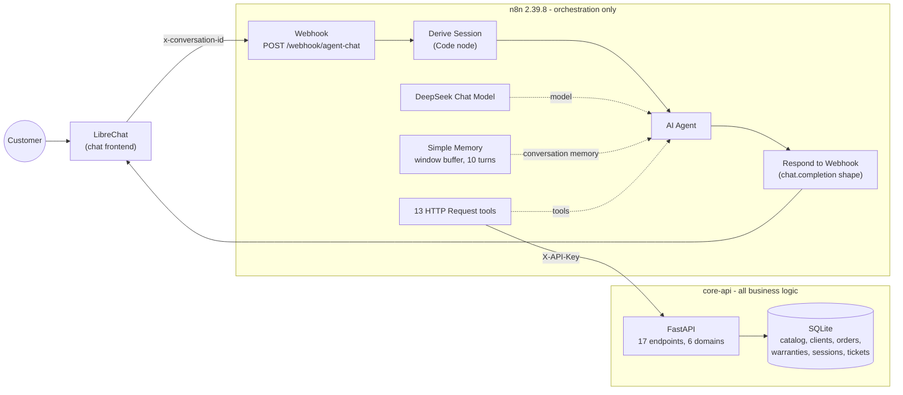

# AI Customer-Service Agent for Electronics Retail


A conversational customer-service agent for an electronics store. It sells consultatively from a
real catalog, tracks orders, checks warranty coverage, files claims, and hands the conversation
to a human when it should. It speaks Colombian Spanish to the customer and never states a fact
it did not get from a tool call.

The agent is an [n8n](https://n8n.io) workflow that orchestrates an LLM and thirteen tools. Every
one of those tools is an HTTP call into a [FastAPI](https://fastapi.tiangolo.com) microservice
that owns the catalog, the orders, the warranties and the memory. A chat frontend such as
[LibreChat](https://www.librechat.ai) talks to the workflow over a single OpenAI-compatible
webhook.

## Table of contents

- [Architecture](#architecture)
- [What is in this repository](#what-is-in-this-repository)
- [Quick start](#quick-start)
- [Talking to the agent](#talking-to-the-agent)
- [The three scenarios](#the-three-scenarios)
- [Tool catalog](#tool-catalog)
- [Sessions and memory](#sessions-and-memory)
- [Connecting LibreChat](#connecting-librechat)
- [Editing the system prompt](#editing-the-system-prompt)
- [Configuration](#configuration)
- [Recording a demo](#recording-a-demo)
- [Further reading](#further-reading)

## Architecture



**The key design decision: n8n orchestrates, it does not decide.** Not a single business rule
lives in the workflow. Whether a warranty is still valid, whether an order's address may still
change, whether a phone number is well formed, whether a claim mentions a safety risk and must
be escalated automatically -- all of that is computed by the microservice and returned as data.
n8n contributes exactly three things: it turns an HTTP request into an agent invocation, it
resolves a session key, and it lets the LLM pick which tool to call.

That split is what makes the system testable. The microservice has 190 unit tests and an OpenAPI
spec; the rules are asserted there, in Python, not inferred from a screenshot of a node graph.
It also means the agent cannot quietly drift: if the LLM asks for something the store refuses,
it gets a `4xx` with an explicit reason and has to tell the customer, instead of a node
half-succeeding.

Two more decisions worth calling out:

- **A webhook, not n8n's built-in Chat Trigger.** The workflow speaks the OpenAI
  `chat/completions` request and response shape, so any OpenAI-compatible frontend can drive it
  with no adapter, and `curl` is a first-class client for testing.
- **Comparison happens server-side.** `compare_products` returns the fields where products
  actually differ, rather than handing the model two blobs of JSON and hoping it diffs them
  correctly.

## What is in this repository

```
.
├── README.md                     # this file
├── docker-compose.yml            # brings up both services
├── CLAUDE.md                     # repository conventions
├── core-api/                     # FastAPI microservice (see core-api/README.md)
│   ├── app/                      # routers, repositories, schemas, SQLite access
│   ├── tests/                    # 190 pytest tests
│   └── Dockerfile
├── n8n-instance/
│   ├── workflows/
│   │   └── agente-retail-electronica.json   # the importable workflow export
│   ├── prompts/
│   │   └── system_prompt.md      # source of truth for the agent's system message
│   ├── sync_prompt.py            # injects the prompt into the workflow JSON
│   ├── README.md                 # prompt editing and import flow
│   └── data/                     # n8n's own state, bind-mounted, not versioned
└── librechat/
    └── librechat.custom-endpoint.example.yaml   # LibreChat wiring example
```

## Quick start

### 1. Bring up both services

```bash
docker compose up -d --build
```

This builds and starts the microservice on `http://localhost:8000` and n8n on
`http://localhost:5678`. The SQLite database is created and seeded on the microservice's first
boot. Check it:

```bash
curl http://localhost:8000/health
# {"status":"ok"}
```

Interactive API documentation is at `http://localhost:8000/docs`.

### 2. Create the n8n owner account

Open `http://localhost:5678` and complete n8n's first-run screen (email, password, name). This
is a local account for your own n8n instance; nothing leaves the machine.

### 3. Create the two credentials

The workflow needs exactly two credentials:

| Credential | n8n type | Used by | What it holds |
|---|---|---|---|
| `Tools API Key` | Header Auth (`httpHeaderAuth`) | the 13 tool nodes | header name `X-API-Key`, value = the microservice's `TOOLS_API_KEY` |
| `DeepSeek account` | DeepSeek (`deepSeekApi`) | the `DeepSeek Chat Model` node | your DeepSeek API key, from https://platform.deepseek.com |

The exported workflow references these by id, so the simplest path is to import them from the
command line with the ids already pinned. Then the workflow import resolves them immediately and
you do not have to reassign a credential in fourteen nodes by hand.

```bash
cat > /tmp/n8n-credentials.json <<'EOF'
[
  { "id": "ToolsApiKey00001", "name": "Tools API Key", "type": "httpHeaderAuth",
    "data": { "name": "X-API-Key", "value": "change-me" } },
  { "id": "KNq4cJ0ct3cSwa6L", "name": "DeepSeek account", "type": "deepSeekApi",
    "data": { "apiKey": "PUT-YOUR-DEEPSEEK-API-KEY-HERE" } }
]
EOF

docker compose cp /tmp/n8n-credentials.json n8n:/tmp/n8n-credentials.json
docker compose exec n8n n8n import:credentials --input=/tmp/n8n-credentials.json
rm /tmp/n8n-credentials.json
```

The `change-me` value must match whatever `TOOLS_API_KEY` the `api` service is running with; see
[Configuration](#configuration). Delete the temporary file afterwards -- it holds your DeepSeek
key in clear text.

You can equally create both credentials in the n8n editor (Credentials, then New). If you do,
import the workflow first and then open each node that shows a credential warning and pick the
credential you created, because a credential created in the UI gets a new random id that the
export does not reference.

### 4. Import and activate the workflow

```bash
docker compose cp n8n-instance/workflows/agente-retail-electronica.json n8n:/tmp/workflow.json
docker compose exec n8n n8n import:workflow --input=/tmp/workflow.json
docker compose exec n8n n8n publish:workflow --id=drK12CNSD8aZJyYl
docker compose restart n8n
```

The restart is required: n8n registers production webhooks at boot, and it says so itself when
publishing (`Please restart n8n for changes to take effect`). Confirm the workflow landed:

```bash
docker compose exec n8n n8n list:workflow
# drK12CNSD8aZJyYl|Retail Electronics Customer Service Agent
```

In the editor at `http://localhost:5678` the workflow appears as
*Retail Electronics Customer Service Agent*, 19 nodes. You can also import it there with
Workflows, then Import from File, and flip the Active toggle instead of using the CLI.

Keeping the `id` field in the JSON is what makes a re-import update the existing workflow rather
than create a duplicate.

## Talking to the agent

The webhook accepts an OpenAI `chat/completions` request and answers with an OpenAI
`chat.completion` response, so the conversation is just the `messages` array you send back each
turn.

```bash
curl -s -X POST http://localhost:5678/webhook/agent-chat \
  -H 'Content-Type: application/json' \
  -H 'x-conversation-id: demo-001' \
  -d '{"messages":[{"role":"user","content":"Hola, necesito un portatil para diseno grafico por menos de 5 millones."}]}'
```

The response, with the assistant text abridged and its accents unescaped (the raw body escapes
them as `\u00e9` and friends):

```json
{
  "id": "chatcmpl-cid-d9a00888d1040888ec444c10",
  "object": "chat.completion",
  "created": 1789864843,
  "model": "deepseek-flash",
  "choices": [
    {
      "index": 0,
      "message": {
        "role": "assistant",
        "content": "Con gusto. Busqué en el catálogo portátiles hasta 5 millones y encontré dos opciones..."
      },
      "finish_reason": "stop"
    }
  ]
}
```

The `x-conversation-id` header is optional for a one-shot request but matters as soon as there
is more than one customer; see [Sessions and memory](#sessions-and-memory). A first reply takes
a few seconds, and longer when the agent chains several tool calls.

## The three scenarios

The transcripts below are excerpts from real runs against the running stack, one conversation
each. Nothing is rewritten; the only edits are cuts, marked with `[...]` where a reply is shown
partially. The customer writes without accents, as people do in a chat box; the agent answers in
proper Spanish.

### 1. Consultative sale

The agent reads the budget and the intended use out of a single sentence, searches the real
catalog, compares the candidates server-side, recommends on the basis of the declared use, and
closes the sale -- reading the order back before it creates anything.

> **Customer:** Hola, necesito un portatil para diseno grafico por menos de 5 millones.
>
> **Agent:** Hola, con gusto. Buscando portátiles hasta 5 millones encontré dos opciones, y para
> diseño gráfico la diferencia es grande:
> - UltraBook Air 14 (Zenda) — $3.200.000: Intel i5, 8 GB de RAM, 256 GB de almacenamiento,
>   gráficos integrados, pantalla de 14". Quedan 10 unidades.
> - CreatorBook Pro 15 (Zenda) — $4.800.000: AMD Ryzen 7, 16 GB de RAM, 512 GB, tarjeta gráfica
>   RTX 3050, pantalla de 15". Queda 1 unidad.
>
> Para diseño gráfico te recomiendo el CreatorBook Pro 15: la RAM de 16 GB y la tarjeta gráfica
> dedicada son las que realmente mueven programas como Photoshop, Illustrator o After Effects.
> El UltraBook sirve, pero con 8 GB y gráficos integrados se queda corto para ese uso.
>
> **Customer:** Me quedo con el CreatorBook Pro 15. Mi cedula es 1010101010 y lo envian a Calle
> 10 # 5-20, Bogota.
>
> **Agent:** Perfecto, Camila. Ya tengo tus datos registrados, así que no necesitas volver a
> inscribirte. Antes de crear el pedido te confirmo lo que voy a registrar:
> - Producto: CreatorBook Pro 15 (Zenda), $4.800.000
> - Dirección de entrega: Calle 10 # 5-20, Bogotá
> - A nombre de: Camila Rodríguez, cédula 1010101010
>
> ¿Confirmas que lo hago así?
>
> **Customer:** Si, confirmo.
>
> **Agent:** Listo, Camila. Tu pedido quedó creado con el número order-e72a5462, y quedó
> registrado y en preparación. La entrega estimada es el 25 de septiembre de 2026, a la
> dirección Calle 10 # 5-20, Bogotá.

Nobody told the agent the customer's name. It greeted her as Camila because `verify_client`
recognised the identification number and returned her record, and the prompt tells it to use a
returning customer's name rather than ask them to register again.

### 2. Order tracking

The customer does not know their order number. The agent asks for the identification instead,
lists what it finds, and translates the internal status code into plain language.

> **Customer:** Hola, quiero saber donde esta mi pedido.
>
> **Agent:** Hola, con gusto te ayudo con eso. Para consultar tu pedido necesito tu número de
> cédula. ¿Me lo compartes, por favor?
>
> **Customer:** Mi cedula es 1010101010
>
> **Agent:** Encontré varios pedidos registrados a tu nombre. ¿Cuál de estos quieres revisar?
> - order-001, un computador portátil, con entrega estimada para el 24 de septiembre
> - order-002, unos audífonos, entrega estimada el 21 de septiembre
> - order-003, una tablet, ya entregado
> - order-004, un celular, cancelado
>
> [...]
>
> Dime el número del pedido y te cuento en qué va.
>
> **Customer:** El order-002
>
> **Agent:** Tu pedido order-002, los audífonos, ya salió del centro de distribución. La entrega
> está estimada para el 21 de septiembre.

`DISPATCHED` never reaches the customer; the prompt maps all six status codes to sentences. The
two orders cut from the list above were left behind by earlier test runs, which is exactly why
the [demo checklist](#recording-a-demo) starts by resetting the database.

### 3. Warranty and escalation

Coverage is checked before anything is promised, the claim description is read back before it is
filed, and the customer's request for a human is honoured immediately -- without asking them to
confirm that, which would be absurd.

> **Customer:** Hola, mis audifonos dejaron de funcionar y creo que tienen garantia.
>
> **Agent:** Hola, gracias por escribirnos. Lamento lo de tus audífonos; con gusto te reviso la
> garantía. Para ayudarte necesito tu cédula, por favor.
>
> **Customer:** Mi cedula es 1010101010, el pedido es el order-002, y lo que pasa es que se
> apagaron de un momento a otro y ya no encienden.
>
> **Agent:** Camila, buenas noticias: revisé tu pedido order-002 y los audífonos sí tienen
> garantía vigente, con 33 meses todavía por cubrir. [...] Para dejarlo listo te confirmo los
> datos que enviaría: pedido order-002, cédula 1010101010 y la falla descrita como "los
> audífonos se apagaron de un momento a otro y ya no encienden". ¿Me confirmas que sí quieres
> radicarlo?
>
> **Customer:** Si, confirmo.
>
> **Agent:** Listo, Camila. Radiqué el reclamo de garantía y quedó registrado con el número de
> caso claim-509af0d6, con ticket ticket-6ac90d97.
>
> **Customer:** Gracias, pero prefiero que me atienda una persona.
>
> **Agent:** Claro que sí, Camila. Ya te pasé con una persona: tu ticket de atención es
> ticket-2aecbfc6 y un agente humano te atenderá en breve. El reclamo de garantía sigue
> registrado con el número claim-509af0d6, así que no se pierde nada.

There is a fourth path worth demonstrating that has no separate scenario: if the claim
description mentions a safety risk (smoke, fire, sparks, an explosion), the **microservice**
creates the human escalation by itself and returns the claim already flagged. That is a
deterministic rule in Python, not a judgement call left to the model, precisely because it is
the case with the least room for error.

## Tool catalog

Thirteen tools, each one node in the workflow and one endpoint in the microservice. All of them
authenticate with the `X-API-Key` header.

| Tool | Endpoint | What it does |
|---|---|---|
| `verify_client` | `GET /api/v1/clients/{client_id}` | Look up a client by identification number. Returns their contact details and, for a returning customer, what they mentioned in past conversations. |
| `register_client` | `POST /api/v1/clients` | Register a new client. The store validates identification, name, phone and email and rejects each one with a specific reason. |
| `save_session_context` | `PUT /api/v1/sessions/{session_id}` | Store what the customer said about themselves this session: name, budget, stated preference. |
| `get_catalog` | `GET /api/v1/catalog/products` | Search the catalog, optionally by category and maximum budget. Returns real prices, specs and stock. |
| `compare_products` | `POST /api/v1/catalog/compare` | Compare products by id and return the fields where they actually differ. |
| `create_order` | `POST /api/v1/orders` | Create an order for one product. Fails if the client is not registered or the product is out of stock. |
| `get_order_status` | `GET /api/v1/orders/{order_id}/status` | Current status of an order. |
| `get_order_eta` | `GET /api/v1/orders/{order_id}/eta` | Estimated delivery date of an order. |
| `update_delivery_address` | `PATCH /api/v1/orders/{order_id}/address` | Change a delivery address. Refused once the order is delivered or cancelled. |
| `list_orders_by_client` | `GET /api/v1/orders/by-client/{client_id}` | Every order of a client, for the customer who does not remember the order number. |
| `get_warranty_status` | `GET /api/v1/warranty/status` | Whether a product in an order has coverage and whether it is still valid. Distinguishes "never registered" from "expired". |
| `file_warranty_claim` | `POST /api/v1/warranty/claims` | File a claim and return a ticket number. Escalates safety cases automatically. |
| `escalate_to_human` | `POST /api/v1/escalations` | Hand the conversation to a human agent and return a ticket number. |

The microservice exposes a few more endpoints the agent deliberately cannot reach, including two
development-only ones (`PATCH /api/v1/orders/{order_id}/status` and
`PATCH /api/v1/warranty/{warranty_id}/terminate`) that exist so you can put the seed data into
any state you want for a demo. See [`core-api/README.md`](core-api/README.md) and
`http://localhost:8000/docs`.

## Sessions and memory

Memory is deliberately split in two, because the two kinds of memory fail differently.

**Conversational memory** is n8n's `Simple Memory` window buffer: the last 10 turns of raw
dialogue, keyed by session id. It keeps the chat coherent, and it is explicitly *not* trusted
for facts, since it silently drops the oldest turns.

**Structured memory** lives in the microservice, in SQLite. A `sessions` row holds the slots the
agent is told not to lose -- customer name, budgets mentioned, products viewed, last order
consulted, stated preferences -- and it exists even before the customer has identified
themselves, which is the normal case (a budget is usually mentioned before a cedula is). Once
the customer does identify themselves, that context is linked to the client and resurfaces on a
later, separate conversation: this is why the agent in scenario 1 greets Camila by name.

Some of those slots are written by the agent through `save_session_context`, and some are
side effects the microservice records on its own: looking up a product records it as viewed,
checking an order records it as the last order consulted. The agent is not asked to remember to
remember.

### How the session id is derived

The `Derive Session` node resolves a session key from three sources, most trustworthy first:

1. **The `x-conversation-id` request header** (or a `conversation_id` field in the body). Hashed
   into `cid-<digest>`.
2. **A hash of the first user message**, when no conversation id was supplied. This is what
   makes plain `curl` testing work: replay the same opening message and you stay in the same
   session across turns.
3. **The n8n execution id**, for a request with no usable content at all.

Tier 2 is a convenience for testing and a hazard in production. Two different customers who both
open with "Hola" hash to the same key, land in the same session, and see each other's memory
buffer and stored context. **Any real frontend must send `x-conversation-id`.** The LibreChat
example config does, and that is the single most important line in it.

## Connecting LibreChat

LibreChat is a separate application with its own Compose stack (MongoDB, Meilisearch and the
rest), so it is not part of this repository's `docker-compose.yml`. What is here is the wiring:
[`librechat/librechat.custom-endpoint.example.yaml`](librechat/librechat.custom-endpoint.example.yaml)
is a fully commented `librechat.yaml` that registers this agent as an OpenAI-compatible custom
endpoint.

The short version:

- Copy the file into your LibreChat project root as `librechat.yaml` and bind-mount it to
  `/app/librechat.yaml` in LibreChat's `api` service.
- Pick the right `baseURL`. If LibreChat runs in its own Compose project on the same host, use
  `http://host.docker.internal:5678/webhook/agent-chat` (on plain Linux add
  `extra_hosts: ["host.docker.internal:host-gateway"]`). If LibreChat is attached to this
  project's Compose network, use `http://n8n:5678/webhook/agent-chat`. Only a LibreChat running
  directly on the host may use `localhost`: inside a container, `localhost` is the container's
  own loopback and the request never reaches n8n.
- `directEndpoint: true` is required, because LibreChat otherwise appends `/chat/completions` to
  `baseURL` and would call a path the webhook does not serve.
- `apiKey` is required by LibreChat's schema but unused by the webhook, so it is a dummy
  literal. The only real key in the system is the one n8n sends to the microservice, and it
  lives in an n8n credential.
- The `headers` block sends `x-conversation-id: "{{LIBRECHAT_BODY_CONVERSATIONID}}"`, which maps
  one LibreChat conversation to exactly one agent session.

The file explains each of these inline, with the reasoning.

### Standing LibreChat up from scratch

```bash
git clone --depth 1 https://github.com/danny-avila/LibreChat.git
cd LibreChat
cp .env.example .env
cp docker-compose.override.yml.example docker-compose.override.yml
cp /path/to/this/repo/librechat/librechat.custom-endpoint.example.yaml ./librechat.yaml
```

Then edit `docker-compose.override.yml` down to just the config-file mount:

```yaml
services:
  api:
    volumes:
      - type: bind
        source: ./librechat.yaml
        target: /app/librechat.yaml
```

`docker compose up -d`, then open `http://localhost:3080`. Create the first account through the
UI, or from the command line without a browser:

```bash
docker exec LibreChat npm run create-user -- you@example.com "Your Name" "username" "Password1!" --email-verified=true
```

The agent then appears in the endpoint selector under the `name` set in `librechat.yaml`.

### Four things that will cost you time on Linux

These are not in LibreChat's own quick start, and each one fails in a way that does not point at
its cause.

1. **Set `UID` and `GID` in `.env`.** Several services declare `user: "${UID}:${GID}"`. Those are
   not exported by default in most shells, so they resolve to empty and the containers fail to
   start. Append `UID=1000` and `GID=1000` (match `id -u` / `id -g`).
2. **Fix bind-mount ownership before the first run.** Docker creates `meili_data_*`, `images`,
   `uploads`, `logs` and `data-node` as root when they do not exist, but the containers run as
   uid 1000, so Meilisearch crashloops with a bare `Permission denied (os error 13)` that never
   names a path. Run `chown -R 1000:1000` on them. Without host root, a throwaway container does
   it: `docker run --rm -v "$PWD":/fix alpine sh -c 'chown -R 1000:1000 /fix/meili_data_* /fix/images /fix/uploads /fix/logs /fix/data-node'`.
3. **Fill in the four blank secrets.** `CREDS_KEY`, `CREDS_IV`, `JWT_SECRET` and
   `JWT_REFRESH_SECRET` ship empty. LibreChat starts anyway, generating temporary values on every
   boot, which quietly invalidates every session on restart. Generate them once
   (`openssl rand -hex 32`, and `openssl rand -hex 16` for `CREDS_IV`) and put them in `.env`.
4. **The admin panel reads `ADMIN_PANEL_SESSION_SECRET`, not `SESSION_SECRET`.** Its error message
   says `SESSION_SECRET must be set to at least 32 characters`, which sends you to the wrong
   variable; the Compose file maps the former onto the latter. Only the admin panel needs it, so
   skip it if you do not use that UI.

### Verifying the wiring without the browser

The failure most likely to bite is network reachability, and it is worth isolating from
LibreChat's UI. This runs a real request from inside LibreChat's own container (it ships Node but
not curl):

```bash
docker exec LibreChat node -e '
fetch("http://host.docker.internal:5678/webhook/agent-chat", {
  method: "POST",
  headers: {"Content-Type": "application/json", "x-conversation-id": "wiring-test"},
  body: JSON.stringify({messages: [{role: "user", content: "Hola"}]})
}).then(r => r.text()).then(console.log).catch(e => console.log("FAILED:", e.message));'
```

A `chat.completion` body comes back on success. If the returned `id` carries a `cid-` prefix, the
`x-conversation-id` header reached the workflow and is being used as the session key, which is
the behaviour that matters.

## Editing the system prompt

The agent's behaviour -- the Colombian Spanish, the anti-hallucination rules, the
confirm-before-mutating rule, the status-code wording table -- lives in
[`n8n-instance/prompts/system_prompt.md`](n8n-instance/prompts/system_prompt.md), not in the
workflow JSON. That file is the source of truth; a sync script injects it into the `AI Agent`
node so the prompt can be reviewed in version control with readable diffs instead of as an
escaped one-line JSON string.

```bash
cd n8n-instance
python3 sync_prompt.py workflows/agente-retail-electronica.json
```

Then re-import and republish the workflow as in [step 4](#4-import-and-activate-the-workflow).
Do not edit the system message in the n8n editor: the next sync run overwrites it. Full flow in
[`n8n-instance/README.md`](n8n-instance/README.md).

## Configuration

Both services read their configuration from the environment, and `docker-compose.yml` supplies
defaults so `docker compose up` works with no setup.

| Variable | Service | Default | Description |
|---|---|---|---|
| `TOOLS_API_KEY` | `api` | `change-me` | Static key the microservice requires in the `X-API-Key` header. Must match the value in the `Tools API Key` n8n credential. |
| `DATABASE_PATH` | `api` | `./app/data/mock.db` | Path to the SQLite file inside the container. |
| `GENERIC_TIMEZONE` | `n8n` | `America/Bogota` | Timezone n8n uses for scheduling and timestamps. Also sets `TZ`. |

Export `TOOLS_API_KEY` in your shell (or put it in a root `.env`) before `docker compose up` to
use something other than the sample key, and set the same value in the n8n credential.

The DeepSeek API key is *not* an environment variable: it is stored in an n8n credential,
encrypted with the instance key in `n8n-instance/data/`, which is gitignored. Nothing in this
repository contains a key, including the workflow export.

Ports: `8000` for the microservice, `5678` for n8n.

### Persistence and resetting

The microservice's database lives on a named Docker volume and n8n's state in the bind-mounted
`n8n-instance/data/`. Both survive `docker compose restart` and `docker compose down`.

```bash
docker compose down -v      # drops the API volume, reseeds the catalog on next boot
```

`down -v` resets the *store* data -- catalog stock, the six seeded orders, clients, warranties,
claims and tickets -- back to the clean fixture set. It does not touch the n8n bind mount, so
your workflow, credentials and n8n login survive it.

## Recording a demo

A short checklist for a screen recording of the three scenarios.

**Before you start:**

1. `docker compose down -v && docker compose up -d` -- this is not optional. Live testing leaves
   real rows behind: extra clients, extra orders, filed claims, escalation tickets, depleted
   stock, and any delivery address the agent was asked to change. A demo against a dirty
   database lists more orders than the four seeded for the customer and offers a laptop that has
   already sold out.
2. Wait for `curl http://localhost:8000/health` to answer, then confirm the workflow is active
   in the n8n editor.
3. Have the n8n executions list open in a second window. Showing the tool calls the agent made
   is more convincing than the chat alone.
4. Useful seed data: client `1010101010` is Camila Rodriguez, with orders `order-001` (pending),
   `order-002` (dispatched, headphones, warranty valid), `order-003` (delivered, tablet,
   warranty expired) and `order-004` (cancelled). Client `2020202020` is Andres Gomez.

**What to show, in this order:**

1. **Consultative sale.** "Necesito un portatil para diseno grafico por menos de 5 millones."
   Then accept the recommendation, give cedula `1010101010` and an address, and confirm. Point
   out that the agent greeted the customer by name from the identification number alone, and
   that it read the order back before creating it.
2. **Order tracking.** New conversation. "Quiero saber donde esta mi pedido." Do not give the
   order number; let the agent ask for the cedula, list the orders, then ask for `order-002`.
   Point out the status wording: no internal codes reach the customer.
3. **Warranty and escalation.** New conversation. "Mis audifonos dejaron de funcionar y creo que
   tienen garantia", cedula `1010101010`, order `order-002`. Confirm the claim, then ask for a
   human. Two ticket numbers, and the agent keeps them straight.
4. **Optional, and the most interesting 30 seconds:** file a claim whose description mentions
   smoke or fire and show that the escalation ticket was created automatically by the
   microservice, not by the model.
5. **Optional:** ask for a product the catalog does not have, and show the agent refusing to
   invent one.

Start each scenario as a genuinely new conversation (a new chat in LibreChat, or a different
`x-conversation-id` with `curl`) so the sessions do not bleed into each other.

## Further reading

| Document | What is in it |
|---|---|
| [`core-api/README.md`](core-api/README.md) | The microservice: endpoints, domains, environment, running the tests, running it without Docker. |
| [`n8n-instance/README.md`](n8n-instance/README.md) | Prompt editing and workflow import flow. |
